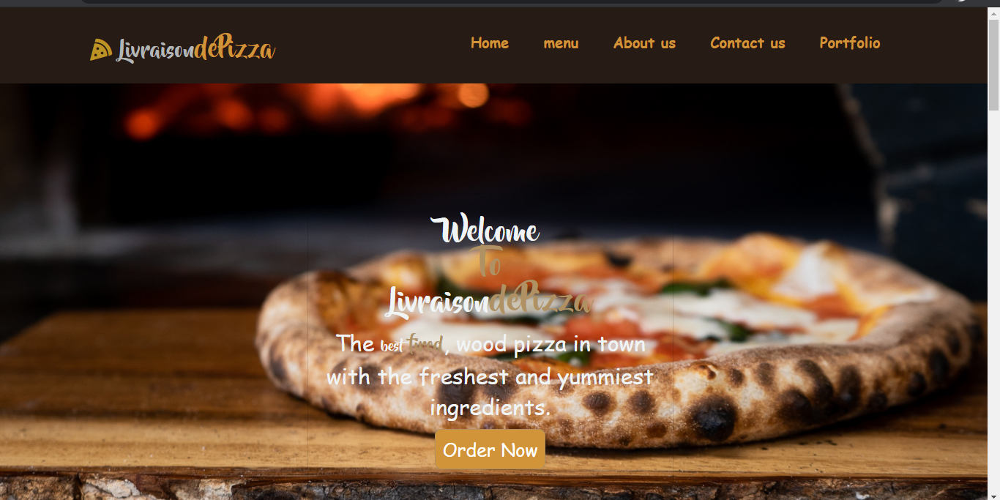
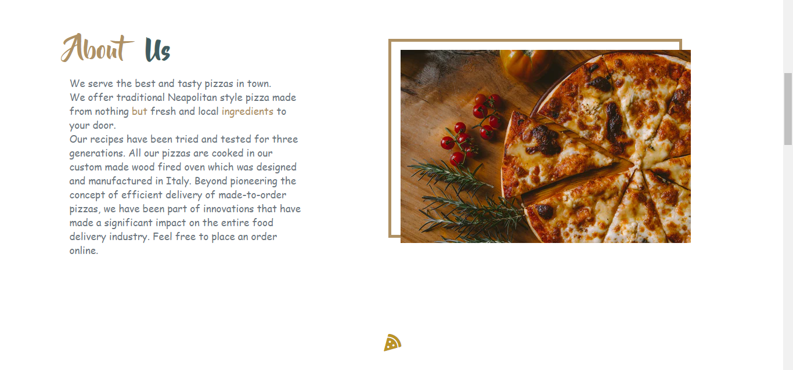

# Livraison de pizza
#### A website for Livraison de pizza, 6th September 2020
#### By **Felista Kiriinya**
## Description
This is a website for Livraison de pizza.
- About Us: allows potential customers to know more about the restaurant.
- Menu: potential customers are able to view all pizza varieties available at the store each havng a short description of the ingredients used.
- Order: potential customers are able to place an order online by selecting a pizza flavor, size, crust, number of pizzas and any extra toppings of their choice. 
- Contact Us: this section contains the pizzeria contact details and a feedback section.

## Development
To make advancements/modifications, follow these steps:

- Fork the repository
- Create a new branch (`git checkout -b improve-feature`)
- Make the appropriate changes in the files
- Add changes made
- Commit your changes (`git commit -am 'Improve feature'`)
- Push to the branch (`git push origin improve-feature`)
- Create a Pull Request 

## Ready to order a scrumptious pizza?
Here's what you need to do:
- Visit the website at https://felkiriinya.github.io/Pizza-Restaurant/
- Read more about the history of the pizzeria in the 'About Us' section
- In the order section, select the pizza flavor, size, crust, number and extra toppings you would like. You are allowed to order more than one flavor and more than one pizza of the same flavor. Great right?
- Carefully read through your order summary. Once content with your orders, click on the checkout button
- You will be prompted to pick between pick up and delivery
- If you choose to pick your order at the store a confirmation message pops up indicating the total amount to be paid at the store on pick up
- If you choose to have your order delivered, a dialog box pops up asking you to provide more details for delivery. After which a confirmation message pops up indicating the total price to be paid on delivery, the delivery location and a phone number with which we shall reach you on
- If you got this far then your order was successfully placed
- Enjoy your pizza and be sure to recommend us to your friends and family!

## Technologies Used
This project is written in HTML5, CSS, Bootstrap, jQuery and JavaScript.

## This is the link to the figma design
[Figma Design](https://www.figma.com/file/rrtUzbzUOTsox5tTCPwkYN/PIZZA-RESTAURAUNT?node-id=0%3A1)

## Support and contact details
Should you be unable to access my web application, have any recommendations or questions, feel free to email me; kamaulorna@gmail.com.

## To-do
1. Track all messages sent in the feedback section

## [License]()
MIT (c) 2020 [Felista Kiriinya](https://github.com/felkiriinya)
